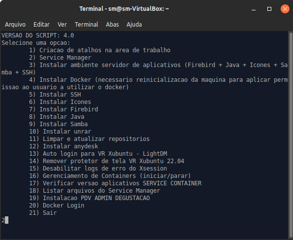

# Estação de trabalho

## Requisitos Mínimos


As informações desse artigo tiveram como fonte a páginal da Wiki oficial da VR ([Requisitos Mínimos](https://wiki.vrsoft.com.br/wiki/index.php/Requisitos\_M%C3%ADnimos) e [VRUbuntu](https://wiki.vrsoft.com.br/wiki/index.php/VRUbuntu\_Instalacao)) e orientações internas. Em caso de informações desatualizadas ou links indisponíveis neste documento, abra uma _issue_.


| Especificações recomendadas  | Service Manager                                                                                                                                    |
| ---------------------------- | -------------------------------------------------------------------------------------------------------------------------------------------------- |
| CPU                          | i3 (2ª geração +) ou equivalente                                                                                                                   |
| Memória RAM                  | 8 GB                                                                                                                                               |
| Versão (sistema operacional) | [VRXubuntu 22.04 LTS (distribuição Linux VRSoftware)](https://storage.googleapis.com/linux-pdv/gbardini/util/sm/vrxubuntu-22.04-desktop-amd64.iso) |
| HD padrão SATA (6Gb/s)       | 50 GB (mínimo)                                                                                                                                     |

## Configuração de atalhos

O VRXubuntu já vem com várias aplicações e ferramentas instaladas que o sistema e o suporte precisa, como o Anydesk e o Java 8. Então é necessário apenas mapear, criar os atalhos na área de trabalho e configurar o vr.properties.


Antes de seguir com a instalação, confirme com o cliente a senha do usuário logado na máquina, pois será necessário executar comandos com permissões elevadas e para isso é necessário autenticar com a senha.\
Padrões de senha da VR: vrserver, vr123456, vrsoftw@re.



Criando atalho no VRXubuntu.


1.  Peça ao cliente o acesso do Anydesk da máquina. Ele pode encontrar o atalho na área de trabalho.

    <figure><figcaption>
Atalho do Anydesk na área de trabalho e número de acesso na janela aberta.
</figcaption></figure>
2. No canto inferior direito da tela, você encontrará o ícone do VRUtil, um utilitário exclusivo do VRUbuntu/VRXubuntu o qual uma das funções é mapear uma pasta da máquina com a pasta vr que está compartilhada no servidor de aplicativos ou de banco de dados do cliente.&#x20;



<figure><figcaption>
Ícone do VRUtil
</figcaption></figure>

Clique com o botão direito sobre o ícone do VRUtil e selecione a opção “Conectar ao Servidor de Aplicação”.

<figure><figcaption>
Clique com o botão esquerdo do mouse na opção desejada.
</figcaption></figure>



Após selecionar a opção, uma nova janela se abrirará pedindo a senha do root. Essa senha é definida durante o processo de formatação da máquina, caso não seja uma senha padrão da VR solicite ao TI.

<figure><figcaption>
Digite a senha do usuário da máquina e clique em Ok.
</figcaption></figure>



Nessa janela, é necessário digitar o caminho da pasta compartilhada do servidor no formato indicado.

<figure><figcaption>
//IP-DO-SERVIDOR-APLICACAO/vr/:user:password
</figcaption></figure>

Nesse caso a pasta compartilhada não é protegida por senha, então vamos omitir o ":user:password".\

<figure><figcaption>
Informe o caminho do servidor aqui sempre com / e não \, conforme o exemplo.
</figcaption></figure>

<figure><figcaption>
Embora a mensagem seja “Conexão realizada”, é recomendado verificar na pasta ~/.vr/server se os arquivos do servidor já encontram.
</figcaption></figure>



Para confirmar que a pasta compartilhada foi mapeada com sucesso na máquina, vamos conferir se os arquivos estão na pasta.

1.  Abra o explorador de arquivos do sistema operacional.\

    <figure><figcaption>
Seleciona o atalho na área de trabalho ou na barra de tarefas.
</figcaption></figure>
2.  A pasta .vr deve estar na pasta home do usuário logado, equivalente à pasta .vr na pasta Usuários do Windows. Por padrão, o explorador de arquivos já abre na pasta home do usuário.\

    <figure><figcaption>
A pasta do usuário aparece com o ícone de casa no lado esquerdo.
</figcaption></figure>
3.  No Linux, assim como no Windows, as pastas iniciadas por "." são ocultas, então para visualizá-las no explorador é necessário ativar esta flag em Ver > Mostrar arquivos ocultos.\

    <figure><figcaption>
A pasta .vr agora aparece no explorador de arquivos.
</figcaption></figure>
4.  Dentro da pasta .vr, você encontrará várias outras pastas e arquivos de configuração que pertencem ao Service Manager e outras aplicações que rodam com o Docker. O que nos interessa no momento é a pasta **server** que é a pasta mapeada nos passos anteriores. \

    <figure><figcaption>
A pasta mapeada está localizada em ~./vr/server/
</figcaption></figure>




Assim como nas estações de trabalho Windows, o ideal é que as aplicações da VR sejam atalhos vinculados a pasta compartilhada do servidor de aplicação para que se mantenham sempre atualizadas e sua atualização manual não seja necessária. Evite apenas copiar os arquivos .jar do servidor direto para a máquina sempre que possível e, se necessário, avise o cliente da necessidade de atualizar os arquivos manualmente depois de uma atualização de sistema.

