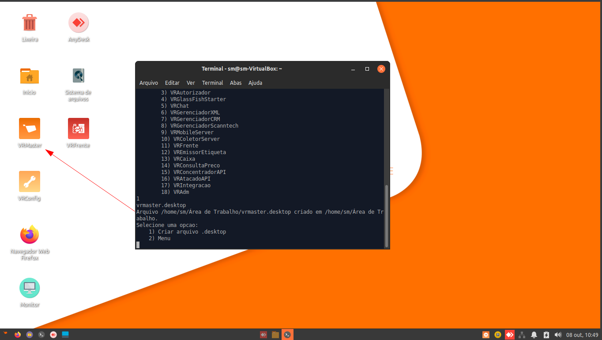

# Estação de trabalho

## Requisitos Mínimos


As informações desse artigo tiveram como fonte a páginal da Wiki oficial da VR ([Requisitos Mínimos](https://wiki.vrsoft.com.br/wiki/index.php/Requisitos\_M%C3%ADnimos) e [VRUbuntu](https://wiki.vrsoft.com.br/wiki/index.php/VRUbuntu\_Instalacao)) e orientações internas. Em caso de informações desatualizadas ou links indisponíveis neste documento, abra uma _issue_.


| Especificações recomendadas  | Estação de trabalho                                                                                                                                |
| ---------------------------- | -------------------------------------------------------------------------------------------------------------------------------------------------- |
| CPU                          | i3 (2ª geração +) ou equivalente                                                                                                                   |
| Memória RAM                  | 8 GB                                                                                                                                               |
| Versão (sistema operacional) | [VRXubuntu 22.04 LTS (distribuição Linux VRSoftware)](https://storage.googleapis.com/linux-pdv/gbardini/util/sm/vrxubuntu-22.04-desktop-amd64.iso) |
| HD padrão SATA (6Gb/s)       | 50 GB (mínimo)                                                                                                                                     |

## Configuração de atalhos

O VRXubuntu já vem com várias aplicações e ferramentas instaladas que o sistema e o suporte precisa, como o Anydesk e o Java 8. Então é necessário apenas mapear, criar os atalhos na área de trabalho e configurar o vr.properties.


Antes de seguir com a instalação, confirme com o cliente a senha do usuário logado na máquina, pois será necessário executar comandos com permissões elevadas e para isso é necessário autenticar com a senha.\
Padrões de senha da VR: vrserver, vr123456, vrsoftw@re.



Criando atalho no VRXubuntu.


1.  Peça ao cliente o acesso do Anydesk da máquina. Ele pode encontrar o atalho na área de trabalho.

    <figure><figcaption><p>Atalho do Anydesk na área de trabalho e número de acesso na janela aberta.</p></figcaption></figure>
2. No canto inferior direito da tela, você encontrará o ícone do VRUtil, um utilitário exclusivo do VRUbuntu/VRXubuntu o qual uma das funções é mapear uma pasta da máquina com a pasta vr que está compartilhada no servidor de aplicativos ou de banco de dados do cliente.&#x20;


Assim como nas estações de trabalho Windows, o ideal é que as aplicações da VR sejam atalhos vinculados a pasta compartilhada do servidor de aplicação para que se mantenham sempre atualizadas sem trabalho manual. Evite apenas copiar os arquivos .jar do servidor direto para a máquina sempre que possível e, se necessário fazer, avise o cliente da necessidade de atualizar os arquivos manualmente depois de uma atualização de sistema já que o atalho não estará ligado a pasta do servidor.




<figure><figcaption><p>Ícone do VRUtil</p></figcaption></figure>

Clique com o botão direito sobre o ícone do VRUtil e selecione a opção “Conectar ao Servidor de Aplicação”.

<figure><figcaption><p>Clique com o botão esquerdo do mouse na opção desejada.</p></figcaption></figure>



Após selecionar a opção, uma nova janela se abrirará pedindo a senha do root. Essa senha é definida durante o processo de formatação da máquina, caso não seja uma senha padrão da VR solicite ao TI.

<figure><figcaption><p>Digite a senha do usuário da máquina e clique em Ok.</p></figcaption></figure>



Nessa janela, é necessário digitar o caminho da pasta compartilhada do servidor no formato indicado.

<figure><figcaption><p>//IP-DO-SERVIDOR-APLICACAO/vr/:user:password</p></figcaption></figure>

Nesse caso a pasta compartilhada não é protegida por senha, então vamos omitir o ":user:password".\


<figure><figcaption><p>Informe o caminho do servidor aqui sempre com / e não \, conforme o exemplo.</p></figcaption></figure>

<figure><figcaption><p>Embora a mensagem seja “Conexão realizada”, é recomendado verificar na pasta ~/.vr/server se os arquivos do servidor já encontram.</p></figcaption></figure>



Para confirmar que a pasta compartilhada foi mapeada com sucesso na máquina, vamos conferir se os arquivos estão na pasta.

1.  Abra o explorador de arquivos do sistema operacional.\


    <figure><figcaption><p>Seleciona o atalho na área de trabalho ou na barra de tarefas.</p></figcaption></figure>
2.  A pasta .vr deve estar na pasta home do usuário logado, equivalente à pasta .vr na pasta Usuários do Windows. Por padrão, o explorador de arquivos já abre na pasta home do usuário.\


    <figure><figcaption><p>A pasta do usuário aparece com o ícone de casa no lado esquerdo.</p></figcaption></figure>
3.  No Linux, assim como no Windows, as pastas iniciadas por "." são ocultas, então para visualizá-las no explorador é necessário ativar esta flag em Ver > Mostrar arquivos ocultos.\


    <figure><figcaption><p>A pasta .vr agora aparece no explorador de arquivos.</p></figcaption></figure>
4.  Dentro da pasta .vr, você encontrará várias outras pastas e arquivos de configuração que pertencem ao Service Manager, Service Container e outras aplicações que rodam com o Docker. O que nos interessa no momento é a pasta **server** que é a pasta mapeada nos passos anteriores. \


    <figure><figcaption><p>A pasta mapeada está localizada em ~./vr/server/</p></figcaption></figure>
5.  Dentro da pasta server deve ter todo o conteúdo da pasta vr, cujo caminho você configurou pelo VRUtil no passo anterior, incluindo a pasta exec com todas as aplicações .jar do servidor como VRMaster, VRFrente, etc.\


    <figure><figcaption><p>Pasta vr do servidor mapeada para a pasta server na estação de trabalho.</p></figcaption></figure>

    <figure><figcaption><p>Pasta exec com os arquivos .jar necessários para criação dos atalhos.</p></figcaption></figure>


Uma vez confirmado que os arquivos estão na pasta corretamente mapeada, basta agora criar os atalhos na área de trabalho do cliente. Para esse método de criação de atalho, o atalho do VRMaster que já vem por padrão na área de trabalho não funciona pois tem como alvo outra pasta, então recomendo excluí-lo e criar um novo atalho através do script que utilizaremos nos passos seguintes.&#x20;




6. Abra um novo terminal do Linux e execute os seguintes comandos:

```bash
curl https://storage.googleapis.com/linux-pdv/gbardini/util/sm/atalhos.sh -o atalhos.sh
chmod +x atalhos.sh
./atalhos.sh
```

<details>

<summary>Aviso: Coleta insegura</summary>

Ao copiar e colar o comando no terminal, uma janela de aviso pode aparecer com o conteúdo copiado, avisando-o dos riscos de colar comandos arbitrariamente no terminal Linux. Nesse caso em específico, você pode apenas confirmar a cola dos comandos cliquando no botão de "Colar". \


</details>

<figure><figcaption><p>Confirme os comandos e pressione em Colar.</p></figcaption></figure>

<figure><figcaption><p>Após colar, pressione a tecla Enter uma vez para executá-los em sequência.</p></figcaption></figure>

7.  O primeiro comando baixará o script, o segundo comando dará permissão de execução do arquivo baixado (atalhos.sh) e o terceiro comando executará o arquivo, solicitando a senha do usuário logado na máquina. Digite a senha e pressione Enter para executar o script.\


    <figure><figcaption><p>Terminal solicitando a senha do usuário logado chamado sm.</p></figcaption></figure>


No terminal do Linux, é comum não mostrar nenhum caracter ao digitar senhas. Então não espere ver nenhum asterisco (\*) ao digitar a senha, apenas a digite e aperte Enter para confirmar. Se errar e precisar executar o terminal novamente, apenas execute o último comando ./atalhos.sh pois o arquivo já deve estar no lugar com suas permissões.&#x20;


8.  Digitando a senha com sucesso, o script é executado e um menu é impresso no terminal com várias funções utilitárias. Para selecionar uma função, é necessário identificá-la na lista, digitar seu número correspondente e pressionar Enter.\


    <figure><figcaption></figcaption></figure>



A única opção que vamos utilizar nesse manual é a primeira, "Criação de atalhos na área de trabalho".

<figure><figcaption><p>Digite 1 e pressione Enter para seguir.</p></figcaption></figure>



No menu seguinte, precisamos escolher a opção que define o diretório da exec que mapeamos no começo. Como o VRUtil sempre mapeia para a pasta .vr/server/exec dentro da pasta home do usuário logado no momento, a segunda opção será a escolha correta.\


<figure><figcaption><p>Digite 2 e pressione Enter.</p></figcaption></figure>


Em estações de trabalho externas, é comum que os arquivos .jar sejam copiados diretamente para a pasta /vr/exec pois não há acesso a pasta compartilhada e portanto não é possível um mapeamento na pasta server. É necessário sempre escolher a opção que corresponde ao diretório dos arquivos das aplicações, nesse exemplo seria a primeira opção /vr/exec.




Agora você precissa escolher a aplicação que deseja criar o atalho. Vamos criar um atalho da primeira aplicação da lista e mais comum do sistema, VRMaster.\


<figure><figcaption><p>Digite 1 e pressione Enter.</p></figcaption></figure>

Após isso, o script deve criar o atalho do aplicativo na área de trabalho e você poderá escolher entre criar mais um atalho ou voltar para o menu inicial.\


<figure><figcaption><p>Atalho criado.</p></figcaption></figure>



9. Ao tentar abrir o VRMaster ele tentará criar um novo vr.properties no diretório /vr. Para evitar erros na criação dele, criaremos a pasta vr e daremos permissões com os comandos:

```bash
sudo mkdir /vr
sudo chmod -R 2777 /vr
```

<figure><figcaption></figcaption></figure>


Caso apareça a mensagem de erro <mark style="color:red;">mkdir: não foi possível criar o diterório "/vr": Arquivo existe</mark>, significa que a pasta vr já existe e você pode apenas executar o segundo comando para as permissões.


10. Ao abrir o atalho pela primeira vez, uma janela para configurar o vr.properties aparecerá e seus campos devem ser preenchidos conforme as informações do banco de dados e loja do cliente. Você pode copiar as informações do vr.properties, que agora deve estar mapeado na pasta ./vr/server/vr.properties, e _clickar_ no botão "Salvar".\


    <figure><figcaption><p>Configuração do vr.properties.</p></figcaption></figure>


Se tudo estiver correto, o vr.properties será salvo na pasta /vr e a tela de login do VRMaster abrirá.


<figure><figcaption><p>Atalho do VRMaster criado com sucesso!</p></figcaption></figure>


Diferente dos atalhos das aplicações pela pasta compartilhada no Windows, os atalhos no Linux levarão em consideração o vr.properties na pasta vr e não na pasta .vr.


